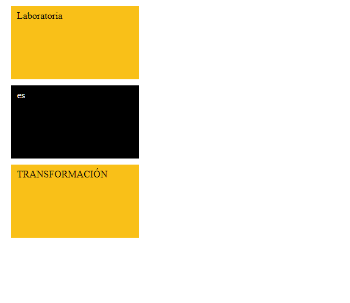
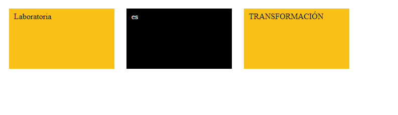

# **Banderas con Display**
#### **FUNCIÓN:**  
##### Es un programa con el cual podemos acceder mediante un menú a dististas vistas de banderas creadas con la propiedad Display de CSS.  
#### **VISTA 1:**

##### En la primera vista hemos hecho uso del valor *BLOCK* de la propiedad Display para que cada una de las banderas esten colocadas uno debajo de otra haciendo un salto de linea, además de que no se le fijo un ancho por lo cual ocupa todo el ancho de su contenedor padre.
#### **VISTA 2:**

##### En la segunda vista hemos hecho uso del valor *BLOCK* de la propiedad Display para que cada una de las banderas esten colocadas uno debajo de otra haciendo un salto de linea; pero en este caso a diferencia de la primera vista se le indicó un ancho (width:210px) por lo cual ya no se expande hasta ocupar todo el ancho de su contenedor padre.
#### **VISTA 3:**

#### En esta tercera vista hemos hecho uso del valor *INLINE-BLOCK* de la propiedad Display para que cada una de las banderas puedan alinearse una al lado de otra pero sin perder su condicón de bloque con un alto de 120px y un ancho de 210px.
#### **VISTA 4:**

##### En esta última vista hemos hecho uso del valor *INLINE* de la propiedad Display para que cada una de las banderas puedan alinearse una lado de la otra ocupando el espacio necesario y ajustando sus medidas al flujo del texto.
